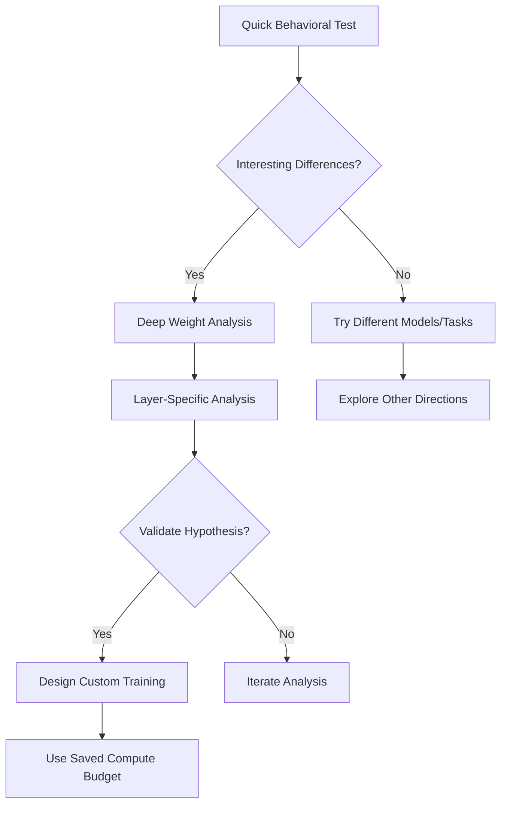

# 🔍 SFT vs RLVR Analysis: Using Existing Models

**Smart approach!** Instead of spending your $2k compute budget, you can analyze the **exact differences** you're looking for using **already-trained Tulu 3 models**. This will give you deep insights before deciding whether to train your own.

## 🎯 **Available Model Progression**

The Tulu 3 series provides the **complete training progression** you want to study:

| **Stage** | **Model** | **What It Shows** |
|-----------|-----------|-------------------|
| **Base** | `meta-llama/Llama-3.1-8B` | Original capabilities |
| **SFT** | `allenai/Llama-3.1-Tulu-3-8B-SFT` | After supervised learning |
| **DPO** | `allenai/Llama-3.1-Tulu-3-8B-DPO` | After preference tuning |
| **RLVR** | `allenai/Llama-3.1-Tulu-3-8B` | After reinforcement learning |

## 📊 **Analysis Options**

### **Option 1: Quick Behavioral Comparison** (Recommended Start)
```bash
python quick_model_comparison.py
```

**What it does:**
- Tests both SFT and RLVR models on the same math problems
- Shows **reasoning differences** in real-time
- Compares **solution approaches** and **confidence**
- **No training required** - just downloads and tests models

**Expected insights:**
- **SFT**: Mimics training examples, predictable reasoning
- **RLVR**: More exploratory, potentially novel solution paths

### **Option 2: Deep Weight Analysis** (Advanced)
```bash
python analyze_weight_differences.py --device cuda
```

**What it does:**
- Analyzes **parameter changes** at the weight level
- Shows which **layers change most** in each approach
- Quantifies the **magnitude of differences**
- Creates **visualizations** of learning patterns

**Requirements:** ~50GB GPU memory or RAM

## 🎯 **Key Questions You'll Answer**

### **1. Learning Dynamics**
- **How do weight changes differ?** SFT vs RLVR modification patterns
- **Which layers are most affected?** Attention vs MLP vs embeddings
- **What's the magnitude difference?** How much do weights actually change

### **2. Reasoning Behavior**
- **Solution diversity:** Does RLVR find multiple solution paths?
- **Confidence patterns:** How certain are the models in their answers?
- **Exploration vs exploitation:** Does RLVR show more creative approaches?

### **3. Sample Efficiency**
- **Weight change per data point:** How efficiently does each method learn?
- **Convergence patterns:** What do the learning curves look like?
- **Transfer learning:** How do changes accumulate through training stages?

## 🚀 **Getting Started**

### **Step 1: Quick Test (Start Here)**
```bash
# Install requirements
pip install transformers torch matplotlib seaborn pandas

# Run quick comparison
python quick_model_comparison.py
# Choose option 1 for behavioral comparison
# Choose option 2 for weight analysis info only
```

### **Step 2: Detailed Analysis (If You Have GPU)**
```bash
# Run full weight analysis (requires GPU/high RAM)
python analyze_weight_differences.py --device cuda --output_dir ./analysis_results

# Check results
ls ./analysis_results/
# - sft_vs_rlvr_comparison.png  (main plots)
# - weight_analysis_report.md   (detailed findings)
```

### **Step 3: Targeted Layer Analysis**
```bash
# Analyze specific layers (e.g., first few layers)
python analyze_weight_differences.py --layer_pattern "layers.0" --device cuda
```

## 📈 **Expected Results**

### **Behavioral Differences:**
- **SFT responses:** More consistent, shorter, direct
- **RLVR responses:** More varied, potentially longer, exploratory

### **Weight Changes:**
- **SFT changes:** Focused on output layers, predictable patterns
- **RLVR changes:** Broader distribution, attention mechanisms affected

### **Learning Patterns:**
- **SFT:** Smooth parameter updates in specific directions
- **RLVR:** More complex update patterns reflecting exploration

## 💡 **Decision Framework**

After analysis, you'll understand:

### **If Results Show Clear Differences:**
→ **Your hypothesis is validated!** 
→ Consider training your own models with specific datasets
→ Use insights to design better experiments

### **If Results Show Minimal Differences:**
→ **Save your compute budget!**
→ Focus on other research directions
→ Try different model sizes or datasets

### **If Results Show Unexpected Patterns:**
→ **New research opportunity!**
→ Investigate specific layer behaviors
→ Design targeted experiments

## 📊 **Analysis Workflow**



## 🔧 **Technical Notes**

### **Model Downloads:**
- Models are **automatically downloaded** from HuggingFace
- First run will take longer (downloading ~15GB per model)
- Subsequent runs use cached models

### **Memory Requirements:**
- **Quick comparison:** ~16GB RAM
- **Weight analysis:** ~50GB RAM or GPU memory
- **Consider cloud instances** if local resources insufficient

### **Output Files:**
- `model_comparison_results.json` - Behavioral comparison data
- `./analysis_results/` - Weight analysis plots and reports

## 🎯 **What You'll Learn**

1. **Mechanistic Differences:** Exactly how SFT and RLVR modify model weights
2. **Behavioral Patterns:** How these weight changes translate to different reasoning
3. **Layer Sensitivity:** Which parts of the model are most affected by each approach
4. **Training Efficiency:** Whether RL changes are more or less efficient than supervised learning

## 🚀 **Next Steps**

Once you understand the differences:

### **If Differences Are Significant:**
- Design targeted experiments on your specific datasets
- Use your compute budget efficiently with focused training
- Explore hybrid approaches (SFT → RLVR sequences)

### **If Differences Are Subtle:**
- Investigate different model architectures
- Try domain-specific datasets where differences might be amplified
- Consider other training methodologies

## 📚 **References**

- **Tulu 3 Paper:** [TÜLU 3: Pushing Frontiers in Open Language Model Post-Training](https://arxiv.org/abs/2411.15124)
- **RLVR Methodology:** Available in the open-instruct codebase
- **Weight Analysis:** Inspired by mechanistic interpretability research

---

**Bottom Line:** Spend 30 minutes analyzing existing models to save 30 hours and $2k in training costs! 🎯 